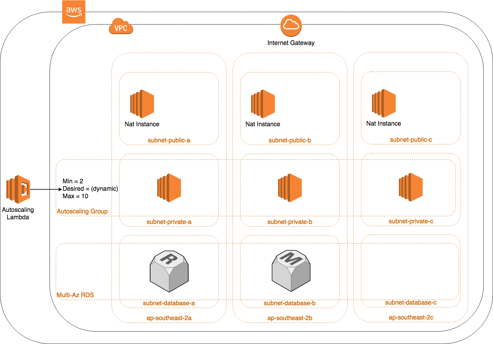

# AWS ECS

[](https://travis-ci.org/GeoscienceAustralia/terraform-ecs)

This repository contains the Terraform modules for creating a production ready ECS cluster in AWS. This repository is designed to be used with [datacube-ecs](https://github.com/opendatacube/datacube-ecs) to define ECS tasks.

* [Requirements](#requirements)
  * [Local System Requirements](#local-system-requirements)
  * [AWS Environment Requirements](#aws-environment-requirements)
* [Config](#config)
  * [Backend Config](#backend-config)
  * [Terraform Variables](#terraform-variables)
* [Create It](#Create-it)
* [Information](#information)
  * [What is ECS](#what-is-ecs)
  * [ECS Infrastructure](#ecs-infrastructure)
  * [Terraform Module](#terraform-module)
  * [SSH Access to the Instances](#ssh-access-to-the-instances)
  * [Logging](#logging)
  * [EC2 node security and updates](#ec2-node-security-and-updates)
* License(#license)
* Contacts(#contacts)

## Requirements

### Local system Requirements
* terraform > v0.10.0
* ecs-cli > 1.0.0 (bda91d5)
* awslogs (recommended)

### AWS Environment requirements
* A Public Route53 hosted zone, that will be used as the default endpoint for our apps
* An Amazon Certificate Manager generated wildcard certificate for the default hosted zone
* An S3 bucket to store infrastructure state
* A DynamoDB table with the primary key name: `LockID` - This is used to lock changes to the state ensuring only one person can deploy at once.
* An SSH KeyPair to be used to access the servers

## Config
To separate the config for your clusters your should create a new folder in the workspaces folder for each cluster.
This folder should include: 
* backend.cfg
* terraform.tfvars

### Backend Config
To enable separation between dev and prod infrastructure we utilise workspaces. Workspaces required a backend.cfg file to identify the backend config for each cluster. This has been designed to enable a multi account workflow separating dev and prod.

```
bucket="ga-aws-dea-dev-tfstate"
key = "datacube-dev/terraform.tfstate"
region = "ap-southeast-2"
dynamodb_table = "terraform"
```

| Name | Description | Type | Default | Required |
|------|-------------|:----:|:-----:|:-----:|
| bucket | The S3 bucket to be used to store terraform state files | string | `` | yes |
| key | The path of the statefile within the bucket | string | `` | yes |
| region | The region of the bucket | string | `` | yes |
| dynamodb_table | A DynamoDB table with the primary key : LockID, used to lock modifications to the statefile | string | `` | yes |

### Terraform Variables

The cluster requires a number of variables to be defined in the `terraform.tfvars` file, these variables are defined below

| Name | Description | Type | Default | Required |
|------|-------------|:----:|:-----:|:-----:|
| vpc_cidr | IP range used by the Virtual Private Cloud in CIDR format | string | `10.0.0.0/16` | yes |
| cluster | Cluster name used to seperate resources from other clusters in the same account | string | `` | yes |
| state_bucket | The S3 bucket that is used to store Terraform state, stored as in paramater store to enable ecs tasks to run terraform | string | `` | yes |
| workspace | Used to seperate infrastructure, should match the workspace folder | string | `` | yes |
| public_subnet_cidrs | List of IP Ranges in CIDR format, must be within vpc_cidr range | List | `` | yes |
| private_subnet_cidrs | List of IP Ranges in CIDR format, must be within vpc_cidr range | List | `` | yes |
| database_subnet_cidrs | List of IP Ranges in CIDR format, must be within vpc_cidr range | List | `` | yes |
| availability_zones | List of AZs to create resources in | List | `` | yes |
| max_size | Max number of worker nodes | number | `` | yes |
| min_size | Min number of worker nodes, should be at least 2 for High Availability | number | `` | yes |
| desired_capacity | Default number of worker nodes to start the cluster with, this will be changed dynamically | number | `` | yes |
| instance_type | The type of instance to run as a worker node  | string | `` | yes |
| owner | A team name to tag on all resources | string | `` | yes |
| enable_jumpbox | If a bastion/jumpbox should be created | boolean | `` | yes |
| key_name | The ssh keypair to associate with the jumpbox and worker nodes | string | `` | yes |
| db_multi_az | Should the Database be created in multiple AZs (Higher Availability), or not (cheaper) | boolean | `` | yes |
| dns_zone | The default DNS zone to associate with the cluster, apps will be given the dns name app.{dns_zone} | boolean | `` | yes |
| dns_zone | The region your *.{dns_zone} cert was issued in | string | `` | yes |
| config_root | A variable to be stored in paramater store, enables apps to find cluster specific config | string | `` | yes |


## Create it
* Set secrets as environment variables to be injected into the script
  * ```TF_VAR_ssh_ip_address``` will restrict ssh access to the jumpbox to this ip address if the jumpbox is enabled
  * ```TF_db_admin_username``` will set the admin username of the rds to this variable
  * ```TF_db_admin_password``` will set the admin password of the rds to this variable
* Deploy your workspace: `./deploy.sh workspace-name` e.g. `./deploy.sh datacube-dev`

## Information
### What is ECS

ECS stands for EC2 Container Service and is the AWS platform for running Docker containers.
The full documentation about ECS can be found [here](https://aws.amazon.com/ecs/), the development guide can be found [here](http://docs.aws.amazon.com/AmazonECS/latest/developerguide/Welcome.html). A more fun read can be found at [The Hitchhiker's Guide to AWS ECS and Docker](http://start.jcolemorrison.com/the-hitchhikers-guide-to-aws-ecs-and-docker/)

To understand ECS it is good to state the obvious differences against the competitors like [Kubernetes](https://kubernetes.io/) or [DC/OS Mesos](https://docs.mesosphere.com/). The major differences are that ECS can not be run on-prem and that it lacks advanced features. These two differences can either been seen as weakness or as strengths.

### ECS infrastructure

As stated above ECS needs EC2 worker nodes to run Docker containers on. To do so you need infrastructure for this. This repository will create the following infrastructure.



What are we creating:

* VPC with a /16 ip address range and an internet gateway
* We are choosing a region and a number of availability zones we want to use. default of three for HA
* In every availability zone we are creating a private, public and database subnet with a /24 ip address range
  * Public subnet convention is 10.x.0.x and 10.x.1.x etc..
  * Private subnet convention is 10.x.10.x and 10.x.11.x etc..
  * Private subnet convention is 10.x.20.x and 10.x.21.x etc..
* In the public subnet we place either NAT instances or a Nat Gateway. Nat instances are the default as they are cheaper for high throughput applications.
* We create an Autoscaling group to host our ECS worker nodes
* We create an ECS cluster that the worker nodes connect to

### Terraform module

To be able to create the stated infrastructure we are using Terraform. To allow everyone to use the infrastructure code, this repository contains the code as Terraform modules so it can be easily used by others.

Creating one big module does not really give a benefit of modules. Therefore the ECS module itself consists of different modules. This way it is easier for others to make changes, swap modules or use pieces from this repository even if not setting up ECS.

Details regarding how a module works or why it is setup is described in the module itself if needed.

Modules need to be used to create infrastructure. For an example on how to use the modules to create a working ECS cluster see **ecs.tf** and **ecf.tfvars**.

**Note:** You need to use Terraform version 0.10.0 and above


### SSH access to the instances

You should not put your ECS instances directly on the internet. You should not allow SSH access to the instances directly but use a bastion/jumpbox server for that. Having SSH access to the dev workspace is fine but you should not allow SSH access to production instances. You don't want to make any manual changes in the production workspace.

### Logging

All ECS logs are pushed to cloudfront, we recommend using awslogs to monitor your logs, it can be installed using pythons' pip `pip install awslogs`

### EC2 node security and updates

Because the EC2 nodes are created by us it means we need to make sure they are up to date and secure. It is possible to create an own AMI with your own OS, Docker, ECS agent and everything else. But it is much easier to use the [ECS optimized AMIs](http://docs.aws.amazon.com/AmazonECS/latest/developerguide/ecs-optimized_AMI.html) which are maintained by AWS with a secure AWS Linux, regular security patches, recommended versions of ECS agent, Docker and more...

This cluster is configured to pull the latest version of the ECS AMI, running it on a schedule will ensure your worker nodes are semi-regularly updated.

To know when to update your EC2 node you can subscribe to AWS ECS AMI updates, like described [here](http://docs.aws.amazon.com/AmazonECS/latest/developerguide/ECS-AMI-SubscribeTopic.html). Note: We can not create a sample module for this because terraform does not support email protocol on SNS.

If you need to perform an update you will need to update the information in the *ecs_instances* and then apply the changes on the cluster. This will only create a new *launch_configuration* but it will not touch the running instances. Therefore you need to replace your instances one by one. There are three ways to do this:

Terminating the instances, but this may cause disruption to your application users. By terminating an instance a new one will be started with the new *launch_configuration*

Double the size of your cluster and your applications and when everything is up and running scale the cluster down. This might be a costly operation and you also need to specify or protect the new instances so that the AWS auto scale does not terminate the new instances instead of the old ones.

The best option is to drain the containers from an ECS instance like described [here](http://docs.aws.amazon.com/AmazonECS/latest/developerguide/container-instance-draining.html). Then you can terminate the instance without disrupting your application users. This can be done by doubling the EC2 nodes instances in your cluster or just by one and doing this slowly one by one. Currently, there is no automated/scripted way to do this. See issue [#3](https://github.com/arminc/terraform-ecs/issues/3)


## License
This code is licensed under the MIT license. See the [license deed](LICENSE) for more details.

## Contacts
**Tom Butler**  
*Lead Developer*  
<tom.butler@ga.gov.au>  
